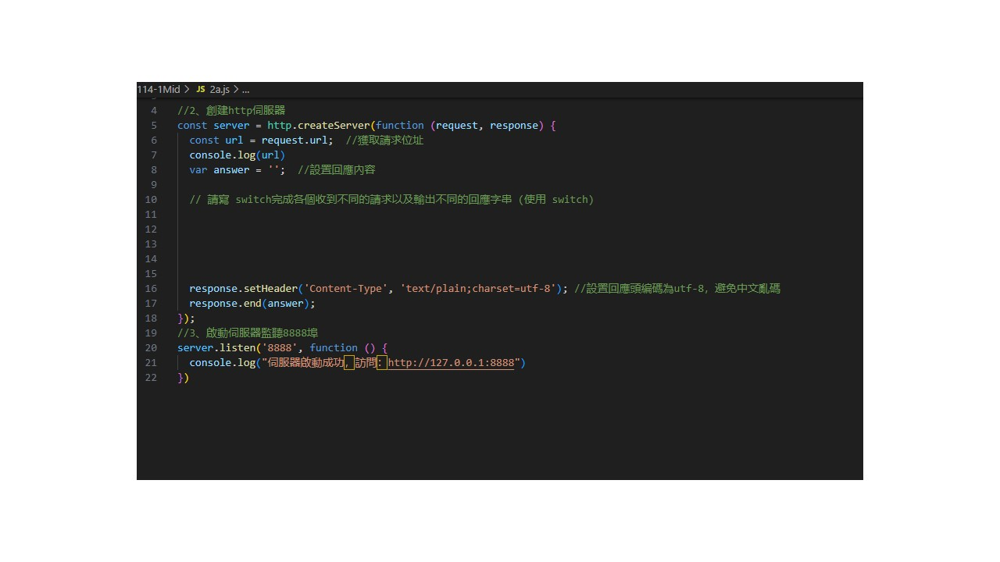
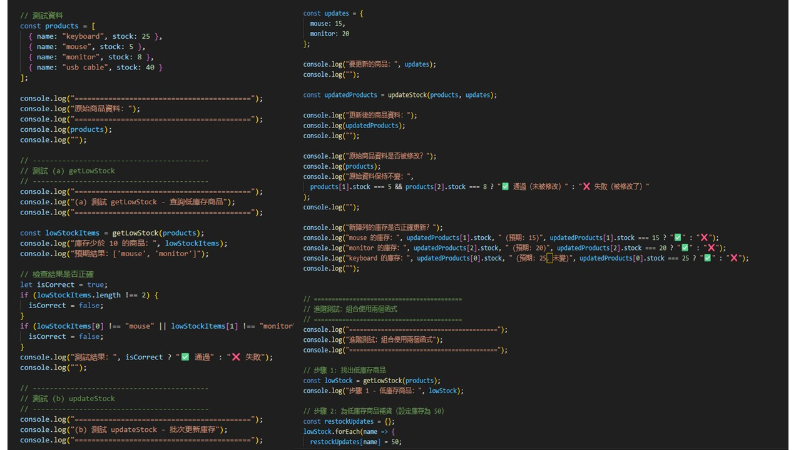
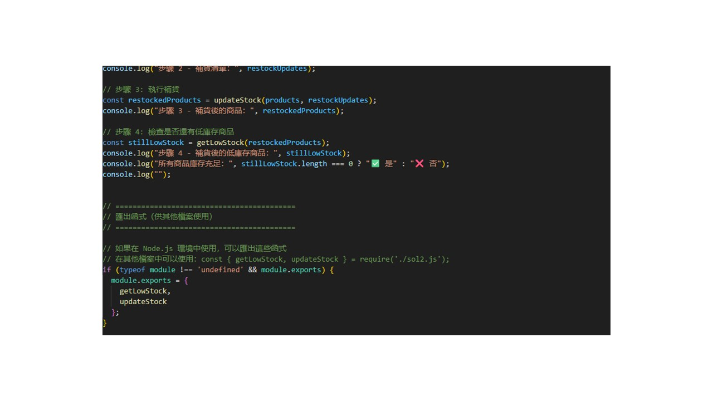
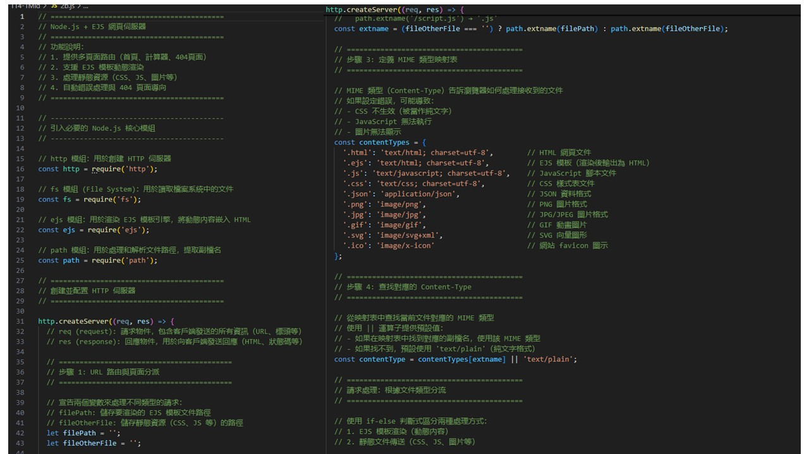
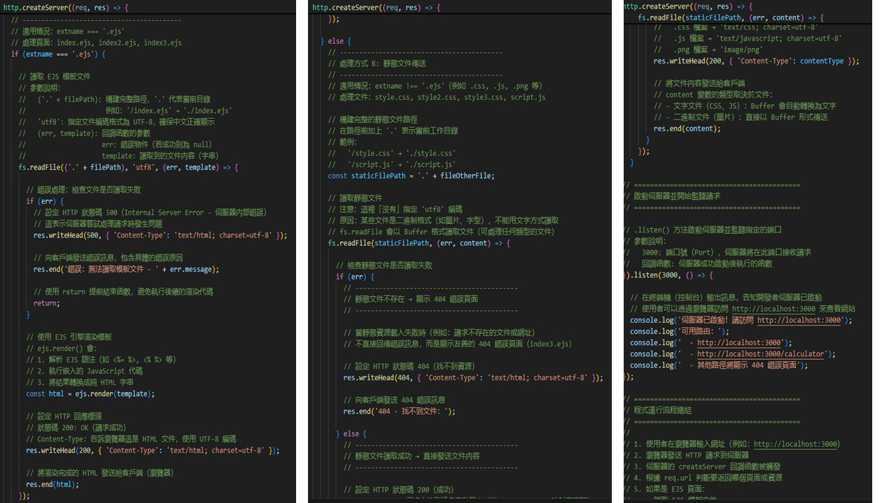

# 第2次隨堂題目-隨堂-QZ2
>
>學號：112111117  (學號和姓名都要寫)
><br />
>姓名：林佳慧
>

本份文件包含以下主題：(至少需下面兩項，若是有多者可以自行新增)
- [x] 說明內容

## 說明程式與內容

開始寫說明，該說明需說明想法，
並於之後再對上述想法的每一部分將程式進一步進行展現，
若需引用程式區則使用下面方法，
若為.cs檔內程式除了於敘述中需註明檔案名稱外，
還需使用語法` ```語言種類 程式碼 ``` `，其中語言種類若是要用python則使用py，java則使用java，C/C++則使用cpp，
下段程式碼為語言種類選擇csharp使用後結果：

```csharp
public void mt_getResult(){
    ...
}
```

若要於內文中標示部分網頁檔，則使用以下標籤` ```html 程式碼 ``` `，
下段程式碼則為使用後結果：

```html
<%@ Page Language="C#" AutoEventWireup="true" ...>

<!DOCTYPE html>

<html xmlns="http://www.w3.org/1999/xhtml">
<head runat="server">
<meta http-equiv="Content-Type" ...>
    <title></title>
</head>
<body>
    <form id="form1" runat="server">
        <div>
        </div>
    </form>
</body>
</html>
```
更多markdown方法可參閱[https://ithelp.ithome.com.tw/articles/10203758](https://ithelp.ithome.com.tw/articles/10203758)

請在撰寫"說明程式與內容"該塊內容，請把原該塊內上述敘述刪除，該塊上述內容只是用來指引該怎麼撰寫內容。

1. a.

Ans: 
先設置一個放置陣列容器元素的匿名變數, 包括物件清單, 會存取商品項目和其數量。讓過路客人更清楚自己的購物清單。
本容器存放陣列, 是「鍵:值」的格式, 外面會用一個大括號, 相當於Python的字典格式。   


1. b.

Ans:

<!-- 請撰寫時，最後一句話再寫一次 -->
```js
function getLowStock(products){
    //創造函式getLowStock, 參數是products
    let LowStockItems = [];
    //創造一個空陣列用來存放低於10的庫存
    for (let i = 0; i < products.length; i++) {
        if(products[i].stock < 10){
            lowStockItems.push(products[i].name);
        };
    };//迴圈會讀取所有包在容器裡的元素並用if條件式擷取庫存低於10的品項
}
```
下方為圖片url連結


1. c.

Ans:
```js
function updateStock(products, updates){
    //建立新的匿名函式updateStock
    const updatedProducts = products.map(
        product_i => { //此變數名稱為當前正在處理的陣列元素
            const productName = product_i.name;
            const newStock = updates[productName];
            if(newStock !== undefined){
                return{
                    ...product_i, stock: newstock
                };else{
                    return {...product_i};
                }
            }
            
        }
    )
}
```
下方為圖片url連結
 
<!--  請撰寫時，第一句話再寫一次  -->

2. a.

Ans:
```js
const server = http.createServer(function(request, response){
    const url = request.url;//獲取請求位址
    console.log(url);
    var answer = '';//設置回應內容
    //使用者先寫出switch陸游完成各個收到不同的請求以及輸出不同的回應字串
    response.setHeader('Content-Type','textplain;charset-utf-8')
    //設置回應頭編碼為utf-8, 以免中文亂碼。
    response.end(answer);
});
server.listen('8888',funtion(){
    console.log("伺服器啟動成功, 訪問:http://127.0.0.1:8888");
})
```
下方為圖片url連結
 

<!--  請撰寫時，第一句話再寫一次  -->

2. b.

Ans:
(b與c為同一題組)
```js
const http = require('http'); //匯入http模組, 用於創建網頁伺服器。
const fs = require('fs'); // 匯入fs模組, 用於讀取在檔案中的文件。
const ejs = require('ejs'); //用於渲然ejs模板引擎, 將動態內容遷入http檔案裡。
const path = require('path'); //path模組, 用於處理和解析文件路徑, 提取副檔名。

//創建並配置http伺服器
http.createServer((req, res) =>{
    //req是請求物件, 包含客戶端發送的所有資訊。
    //res是回應物件, 用於向客戶端發送回應。
    //Step1.路由與頁面分段
    //此處將會宣告兩個變數處理需求,一個存取ejs檔案, 另一個則是處理靜態資源。
    let filePath = ''; //存取渲染的ejs模板物件
    let fileOtherfile = ''; //存取靜態資源(包括css及js檔案)
    //以下設置Switch路由器來根據不同的路由而會有不同的回傳結果。
    switch(req.url){
        case '/':
            filePath = '/index.ejs';
            break
        case '/calculator':
            filePath = '/index2.ejs';
            break
        default:
            filePath = 'index3.ejs';
            break;

    }
    
})
if(req.url.endsWith('.css')) || req.url.endsWith('.js') || req.url.endWith('.png'){
        fileOtherfile= req.url;
}

```
下方為圖片url連結
 
<!--  請撰寫時，第一句話再寫一次  -->

2. c.

Ans:
下方為圖片url連結
 

<!--  請撰寫時，第一句話和最後一句再寫一次  -->

2. d.

Ans:打開終端機時,使用者會依據自身需求而有不同的網頁指令。
從2b.js檔案中, 我們可以依據writehead指令來判斷出客戶端到底跟伺服端要了多少請求
第一次是發送錯誤訊息給客戶端
第二次是把渲染完成的html檔案給客戶端
第三次是向客戶端發送錯誤訊息
第四次是傳送Buffer文字圖片檔
所以客戶端對伺服器端總共4次請求


